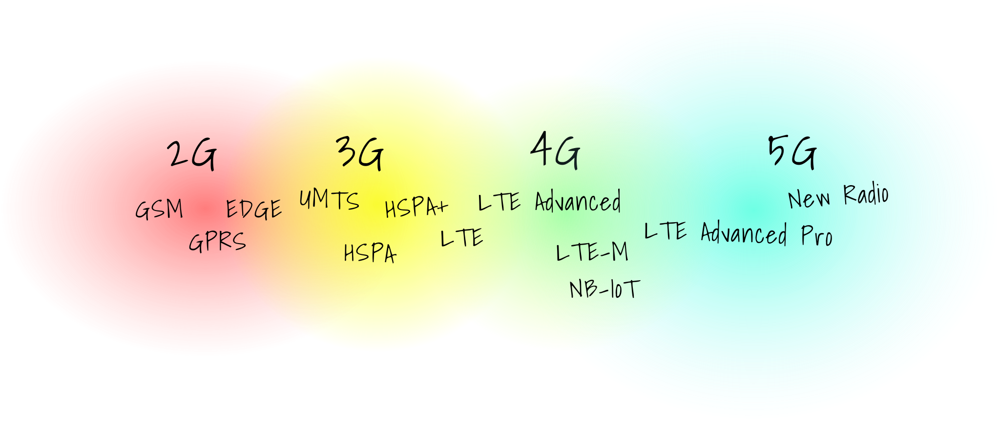

<div align="center">
  
</div>

Telemaster is an app that displays all the telecommunication masts/antennas in Denmark.

[See it in action here https://telemaster.dk](https://telemaster.dk).


## Data Explanation

All the data is based on the information from https://mastedatabasen.dk. The data from the source only indicates the access technologies in a broad manner, i.e. GSM, UMTS, LTE, and 5G-NR. This doesn't make a lot of sense. It is actually more confusing and uninformative compared to all the existing access technologies. Here's an overview:



Therefore the network generations are used instead, although with the caveat that 4G represents LTE and *not* ITU's definition of 4G.

## Development

The app is built as a dumb CRUD app (actually without the 'UD'):


### Installation

In each level one subfolder run:

```bash
yarn # or npm install
```

### API and Database

To run it using Docker simply do `docker-compose up` in the root of the repo.

### Database worker

To populate the database:

1. First run [`mastscraper`](https://github.com/westh/mastscraper) somewhere
2. Edit `MASTS_DIR` in `database-worker/.env.development` to point it to where the output from step 1 is
3. Then run `yarn start`

### Web app

As the web app is using Mapbox you need to provide an API key for that, so the steps to get it running is:

1. Run `export REACT_APP_MAPBOX_TOKEN={your API key goes here}`
2. `yarn start`

## Contributors

Thanks to [Alexandros Dorodoulis](https://github.com/alexdor) for helping out :tada:

## License


<a href="https://www.buymeacoffee.com/westh" target="_blank"></a>
